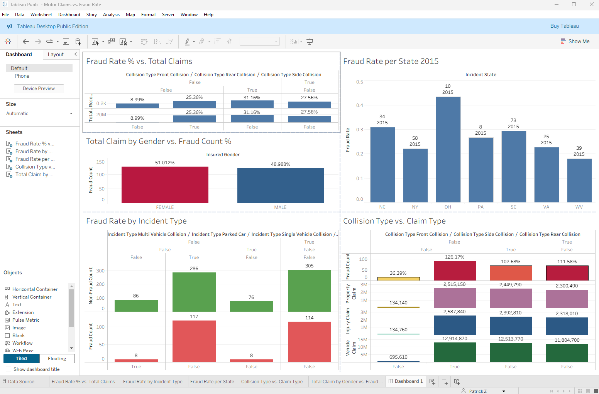

# Insurance Fraud Analytics Project

## Overview

This project aims to detect and analyze fraudulent insurance claims using advanced data analytics and machine learning techniques. Insurance fraud causes significant financial losses for insurance companies and raises premiums for honest policyholders. By analyzing structured insurance claims data, this project seeks to identify patterns, risk factors, and anomalies that indicate fraud.

---

## Objectives

- Clean and preprocess insurance claims data for analysis.
- Explore the characteristics of fraudulent vs. non-fraudulent claims.
- Identify key numeric and categorical features correlated with fraud.
- Visualize data distributions, trends, and relationships with fraud.
- Develop predictive models to detect fraudulent claims (planned future step).
- Provide insights to help insurers detect suspicious claims earlier.

---

## Dataset

The dataset contains records of insurance claims with features such as:

- Claim details (claim amount, claim number, incident type).
- Incident information (collision type, police report availability, incident date).
- Policyholder data (policy bind date).
- Fraud labels indicating confirmed fraud cases.

---

## Project Structure

> Please run notebooks in sequence.

- `etl.ipynb` — Extract, transform, and load pipeline for cleaning and preparing data.
- `eda.ipynb` — Exploratory Data Analysis with visualizations and fraud pattern insights.
- `feature_engineering.ipynb` — Create new features and transform variables for modeling.
- `model_training.ipynb` — Train and evaluate Machine learning model development and evaluation.
- `reporting_dashboard` — Generate visualizations and reports for stakeholders.

---

## Extract, Transform and Load CSV Dataset

Data cleaning and transformation were performed through an ETL pipeline to handle missing values, standardize data, and engineer fraud risk scores.

---

## Exploratory Data Analysis (EDA) Highlights

- The dataset exhibits class imbalance with fewer fraudulent claims than non-fraudulent.
- High-value claims and claims occurring during unusual hours often have higher fraud rates.
- Categorical features like collision type and police report availability show varying fraud risk.
- Missing data indicators help identify potential fraud cases where information is intentionally omitted.
- Daily fraud trends highlight potential seasonal or event-driven spikes in fraudulent activity.

---

## Tools and Libraries

- Data Processing: **pandas, numpy**
- Visualization: **matplotlib, seaborn**
- Machine Learning: **scikit-learn**
- Database & Environment: **sqlalchemy, python-dotenv, os, IPython.display**
- Dashboarding: **Plotly, Dash, Streamlit**

---

## Dashboard Preview



This example dashboard identifies fraud % per state, claim amount vs. gender, the risk score per state and fraud rate by collision (collision type - rear).

---

## Future Steps

- Feature Engineering to improve predictive power.
- Splitting data for training and testing Machine Learning models.
- Model Training using algorithms suited for imbalanced classification.
- Model Evaluation using metrics focused on fraud detection such as precision, recall, F1-score, and ROC-AUC.
- Deploying a fraud scoring system to assist operational fraud detection.

---

## Getting Started and How to Run

1. **Clone this repository:**

```bash
git clone https://github.com/PatZ2346/fraud_analytics_project.git
cd fraud_analytics_project
```

2. **Install dependencies:**
- Make sure you have Python 3.8+ installed. Install required packages using provided requirements.txt: pip install -r requirements.txt

3. **Download and prepare data:**
- Download the dataset from Kaggle: [Auto Insurance Claims Fraud Detection](https://www.kaggle.com/datasets/antopravinjohnbosco/auto-insurance-claims-fraud-detection?resource=download), place it in the data/raw/ folder, and run the etl.ipynb notebook to clean and preprocess the data.
- Place the raw CSV file in the data/raw/ folder.
- Run the ETL notebook to clean and preprocess the data: jupyter notebook etl.ipynb

4. **Run notebooks in order:**
- `Extract, Transform & Load (ETL)`: etl.ipynb
Clean, transform, and prepare data for analysis and modeling.
- `Exploratory Data Analysis (EDA)`: eda.ipynb
Explore data distributions, relationships, and fraud patterns.
- `Feature Engineering`: feature_engineering.ipynb
Create new features and encode variables for modeling.
- `Model Training`: model_training.ipynb
Train, evaluate, and validate fraud detection models.
- `Reporting Dashboard`: reporting_dashboard.ipynb
Generate visual reports and dashboards for insights.

---

## Contributing
Contributions are welcome! Feel free to fork the repo and submit pull requests with improvements or fixes.

---

## License
This project is licensed under the MIT License.

---

## Contact
Created by PatZ.

Email: [patrick.zhou90@gmail.com](mailto:patrick.zhou90@gmail.com)  
GitHub: [@PatZ2346](https://github.com/PatZ2346)  

For issues, feedback or collaborations please open an issue on GitHub.

---

## Resources & Links

### Fraud Detection Models & Feature Engineering

- [GitHub – Insurance Fraud Detection using Decision Trees & Random Forest](https://github.com/kalpesh0987/Insurance_Fraud_Detection_Using_Decision_Trees_and_Random_Forests)  
  Covers end-to-end preprocessing, modeling, and evaluation.

- [Trenton McKinney – Fraud Detection in Python](https://trenton3983.github.io/posts/fraud-detection-python/)  
  Explores imbalanced fraud datasets, model evaluation, and best practices.

- [GitHub – End-to-End Insurance Fraud Detection with XGBoost & Random Forest](https://github.com/annchirackal/Insurance-Fraud-Detection---End-to-End-Project)  
  Includes hyperparameter tuning and model comparison.

---

### Tableau Dashboards for Insurance Analytics

- [Quantize Analytics – 7 Tableau Dashboards for Insurance](https://www.quantizeanalytics.co.uk/tableau-insurance-dashboards-examples/)  
  Real-world dashboard examples for claims and fraud analytics.

- [phData – Insurance Claims Tableau Dashboard Example](https://www.phdata.io/blog/insurance-claims-tableau-dashboard-example/)  
  Executive summary with KPIs and risk breakdown.

- [GitHub – Visualizing Insurance Claims with Tableau](https://github.com/swapnilshinde39/insurance-dashboard)  
  Includes Tableau workbook, datasets, and visualizations.

---

### Tableau Dashboard Tutorials & Videos

- [YouTube – Insurance Fraud Dashboard in Tableau (Tutorial)](https://www.youtube.com/watch?v=dT_WtkxvV_k)  
  Step-by-step dashboard creation demo.

- [Tableau – Insurance Industry Solutions](https://www.tableau.com/solutions/industries/financial-services/insurance)  
  Industry-specific dashboards and use cases from Tableau.

---

### Anomaly Detection & Model Theory

- [ArXiv – A Random Forest Guided Tour (PDF)](https://arxiv.org/abs/1511.05741)  
  Theoretical foundations and best practices.

- [Kaggle – Autoencoder + Random Forest for Fraud Detection](https://www.kaggle.com/code/caiooquinamo/fraud-detection-using-ae-random-forest)  
  Example of combining anomaly detection with supervised learning.

---

### Summary Table

| Topic              | Resource Link                                                                                      | What It Offers                                 |
|--------------------|----------------------------------------------------------------------------------------------------|------------------------------------------------|
| Fraud Modeling     | [Kalpesh GitHub Repo](https://github.com/kalpesh0987/Insurance_Fraud_Detection_Using_Decision_Trees_and_Random_Forests) | Code examples for model building              |
| Class Imbalance    | [Trenton McKinney Blog](https://trenton3983.github.io/posts/fraud-detection-python/)              | Resampling, metrics, and data handling        |
| Dashboard Design   | [Quantize](https://www.quantizeanalytics.co.uk/tableau-insurance-dashboards-examples/)             | Insurance dashboard inspiration               |
| Advanced Models    | [ArXiv + Kaggle](https://www.kaggle.com/code/caiooquinamo/fraud-detection-using-ae-random-forest)  | Anomaly detection and hybrid ML approaches    |
| Tableau Use Cases  | [Tableau Insurance Solutions](https://www.tableau.com/solutions/industries/financial-services/insurance) | Best practice and dashboard templates         |
